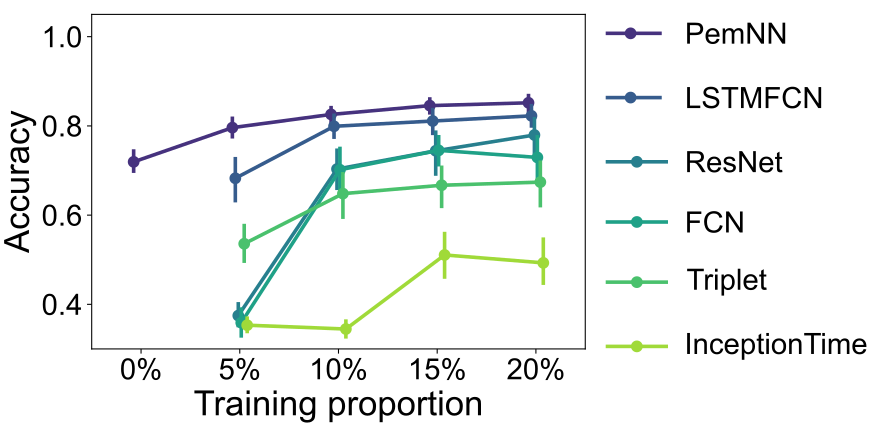

# Deep Learning Frameworks for Classifying Single-Molecule Force Spectroscopy Data
## ❖ Backgrounds:
Deciphering protein folding and unfolding pathways under tension is essential for deepening our understanding of fundamental biological mechanisms. Such insights hold the promise of developing treatments for a range of debilitating and fatal conditions, including muscular disorders like Duchenne Muscular Dystrophy [^1][^2] and neurodegenerative diseases such as Parkinson's disease [^3]. Single molecule force spectroscopy (SMFS) is a powerful technique for investigating the forces involved in protein domain folding and unfolding. However, SMFS trials often involve multiple protein molecules, necessitating filtering to isolate measurements from single-molecule trials. Currently, manual visual inspection is the primary method for classifying single-molecule data, a process that is both time-consuming and requires significant expertise[^4][^5].

## ❖ Problem:

Classify SMFS data into one of three classes - 1) **No molecule**: where no molecule is present between the tip and substrate, 2) **Single molecule**: when only a single molecule or a section of a single molecule is present, or 3) **Multiple molecules**: where multiple molecules or sections of multiple molecules are present between the tip and substrate. 

## ❖ Methods:
Our work is the first to apply state-of-the-art machine learning models (such as ResNet, FCN, InceptionTime, and LSTMFCN) to SMFS data. Additionally, we introduced a novel dual-branch ML architecture, **Polymer Elastic Model Neural Networks (PemNN)**, incorporating protein unfolding physics, a unique approach enabled by SMFS expertise that outperforms baseline models. Furthermore, we provide a Monte Carlo simulation engine to generate force spectroscopy datasets alongside extensive experimental data from atomic force microscopy on a variety of proteins.


## ❖ Data
Here, we have SMFS force curves from non-specific pulling of four different protein molecules. Out of these four protein molecules, only titin I27O (Athena Enzyme Systems™) is an engineered protein molecule composed of eight repeats of the Ig 27 domain of human titin that serves as an AFM reference protein for calibrating and validating our methods. The other three protein molecules come from real natural proteins with considerable variations in their sequence and structure, dystrophin and utrophin. Dystrophin is a protein molecule expressed primarily at the muscle cell membrane, or sarcolemma, in striated muscle tissue. Deficiencies of this protein molecule lead to severe muscle wasting disorder like Duchenne muscular dystrophy (DMD), a fatal disease occurring in 1 out of 4000 male births[^6]. Utrophin is a fetal homologue of dystrophin and is under active investigation as a dystrophin replacement therapy for DMD. We include dystrophin and utrophin fragments encoding the NT through SLR 3 domains, referred to as DysN-R3 and UtrN-R3, respectively. Previous studies have demonstrated that the mechanical properties of UtrN-R3 are influenced by the expression system used, such as insect or bacterial cells [^7]. Consequently, we further categorize UtrN-R3 into insect UtrN-R3 and bact UtrN-R3 to reflect these variations. In summary, our four real protein molecules are: Titin I27O, bact UtrN-R3, insect UtrN-R3, DysN-R3.


For our four molecules: Titin I27O, insect UtrN-R3, bact UtrN-R3, and DysN-R3:
  - The simulation data were generated with [MCSim.py](CallScripts/MCSim.py), which are summarized as .csv files in [ML_Dataset](Data/ML_Dataset). 
  - The experimental data: [TitinI27O Data](Data/Titin_data/Exp_ibw_data), [insect UtrN-R3 Data](Data/UTRNR3_data/Exp_ibw_data), [bact UtrN-R3 Data](Data/UtrNR3_Bact_data/Exp_ibw_data), [Dys-NR3 Data](Data/DysNR3_Bact_data/Exp_ibw_data), which are summarized as .csv files in [ML_Dataset](Data/ML_Dataset).
    


## ❖ Requirements
All required Python packages are listed in [pip-requirements.text](pip-requirements.txt). 
- [tensorflow-metal](https://developer.apple.com/metal/tensorflow-plugin/) uses Mac GPUs. 
- [tslearn](https://github.com/tslearn-team/tslearn/) and [sktime](https://github.com/sktime/sktime) are Python packages for the analysis of time series.

## ❖ Example
```python

# Step 1: Imports
import numpy as np
import pandas as pd
import os
import sys
sys.path.append('../')
from APIs.utils import utils
from APIs.PemNN import PemNN
from APIs.PemNN import Classifier_PemNN

# Step 2: Initialize the toolbox
UtObj = utils()
PemNN = PemNN()

# Step 3: Read data
# Choose moelcule from Titin', 'UtrNR3', 'UtrNR3_bact', 'DysNR3_bact', 
molecule = 'Titin'
df_save_path = '../Data/ML_Dataset/' + molecule +'/' # data save path
file_name = 'Fu_' + molecule + '_sim'
Fu_data_df =  pd.read_pickle(df_save_path + file_name + '_data' + '.csv', )
file_name = 'xp_' + molecule + '_sim'
xp_data_df =  pd.read_pickle(df_save_path + file_name + '_data' + '.csv', )
# model save path
output_directory = 'ML_models/' + molecule + '/saved_model_physics/'
os.makedirs(output_directory, exist_ok=True)
    
# Step 4: Pre-process and train/test split
[
 x_train_phy, x_test_phy, # physical branch data
 x_train, x_test,  # non-physical branch data
 y_train, y_test, # label
 y_train_oh, y_test_oh, # one-hot encoding label
 ] = PemNN.pre_process(Fu_data_df, xp_data_df, test_size = 0.8,) 

# Step 5: Initialize PemNN classifier 
nb_classes = len(np.unique(np.concatenate((y_train, y_test), axis=0))) # No. of classes
clf = Classifier_PemNN(input_shape_pairs = x_train_phy.shape[1:], 
                        input_shape_traces = x_train.shape[1:],
                        nb_classes = nb_classes,
                        output_directory = output_directory,
                        )

# Step 6: Train PemNN
clf.fit([x_train_phy, x_train], y_train_oh,
        batch_size = 16,
        nb_epochs = 200,
        diagonistic = False)

# Step 7: Test PemNN and print metric
[acc, f1, roc_auc, _] = clf.predict([x_test_phy, x_test],y_test)
print('The accuracy is : ' + str(round(acc,4)))

```

<!--
## ❖ Codes
- [MonteCarloSMFS.py](APIs/MonteCarloSMFS.py) contains the necessary functions to conduct Monte Carlo simulations.
- [MCSim.py](CallScripts/MCSim.py) runs Monte Carlo simulations of protein unfolding.
- [PemNN.py](APIs/PemNN.py) contains Polymer Elastic Model Neural Network (PemNN).
- [AFM_ML.py](CallScripts/AFM_ML.py) trains and evaluate both baselines and PemNN.
- [utils.py](APIs/utils.py) contains some utility functions. 


## ❖ Train and Evaluation
Training and evaluation of deep learning models are implemented in [AFM_ML.py](CallScripts/AFM_ML.py). At the start of the script, users can select parameters, such as the dataset and model, to utilize.
-->


## ❖ Results

All deep learning models automates the isolation of single-molecule measurements, significantly enhancing data processing efficiency. With our deep learning approach, the time required to extract meaningful statistics from single-molecule SMFS trials is reduced **from a day to under an hour**. 

Our model (PemNN) achieves state-of-the-art performance, outperforming five baseline methods on both simulated and experimental datasets. It attains nearly 100\% accuracy across all simulated datasets and an average accuracy of $79.6 \pm 5.2$\% on experimental datasets, using only ~30 training samples, surpassing baseline methods by 11.4\%. Notably, even without expert annotations on experimental data, the model achieves an average accuracy of $72.0 \pm 5.9$\% when pre-trained on corresponding simulated datasets. 

- Critical difference diagram of different deep learning models across the simulated and experimental testing sets of all protein molecules based on average accuracies. The most accurate model is assigned a rank of 1, with a thick horizontal line representing a group of classifiers that do not exhibit statistically significant differences in accuracy. 


- The performance of models trained with different proportions of experimental datasets (training proportion), with error bars indicating standard deviations across all experimental datasets over five runs.


## ❖ Reference
No new data were generated for this study. The data are taken from: 
```
@misc{hua_two_2024,
	title = {Two operational modes of atomic force microscopy reveal similar mechanical properties for homologous regions of dystrophin and utrophin},
	copyright = {© 2024, Posted by Cold Spring Harbor Laboratory. This pre-print is available under a Creative Commons License (Attribution-NonCommercial-NoDerivs 4.0 International), CC BY-NC-ND 4.0, as described at http://creativecommons.org/licenses/by-nc-nd/4.0/},
	url = {https://www.biorxiv.org/content/10.1101/2024.05.18.593686v1},
	doi = {10.1101/2024.05.18.593686},
	publisher = {bioRxiv},
	author = {Hua, Cailong and Slick, Rebecca A. and Vavra, Joseph and Muretta, Joseph M. and Ervasti, James M. and Salapaka, Murti V.},
	month = may,
	year = {2024},
}

```

[//]: # (Use APA reference style below)
[^1]: Hoffman, E. P., Brown Jr, R. H., & Kunkel, L. M. (1987). Dystrophin: the protein product of the Duchenne muscular dystrophy locus. Cell, 51(6), 919-928.
[^2]: Ervasti, J. M. (2007). Dystrophin, its interactions with other proteins, and implications for muscular dystrophy. Biochimica et Biophysica Acta (BBA)-Molecular Basis of Disease, 1772(2), 108-117.
[^3]: Hervas, R., Oroz, J., Galera-Prat, A., Goni, O., Valbuena, A., Vera, A. M., ... & Carrión-Vázquez, M. (2012). Common features at the start of the neurodegeneration cascade. PLoS biology, 10(5), e1001335.
[^4]: Bornschlögl, T., & Rief, M. (2011). Single-molecule protein unfolding and refolding using atomic force microscopy. Single Molecule Analysis: Methods and Protocols, 233-250.
[^5]: Lyubchenko, Y. L. (Ed.). (2018). Nanoscale Imaging: Methods and Protocols. Humana Press.
[^6]: Mendell, J. R., Shilling, C., Leslie, N. D., Flanigan, K. M., al‐Dahhak, R., Gastier‐Foster, J., ... & Weiss, R. B. (2012). Evidence‐based path to newborn screening for Duchenne muscular dystrophy. Annals of neurology, 71(3), 304-313.
[^7]: Ramirez, M. P., Rajaganapathy, S., Hagerty, A. R., Hua, C., Baxter, G. C., Vavra, J., ... & Ervasti, J. M. (2023). Phosphorylation alters the mechanical stiffness of a model fragment of the dystrophin homologue utrophin. Journal of Biological Chemistry, 299(2).
